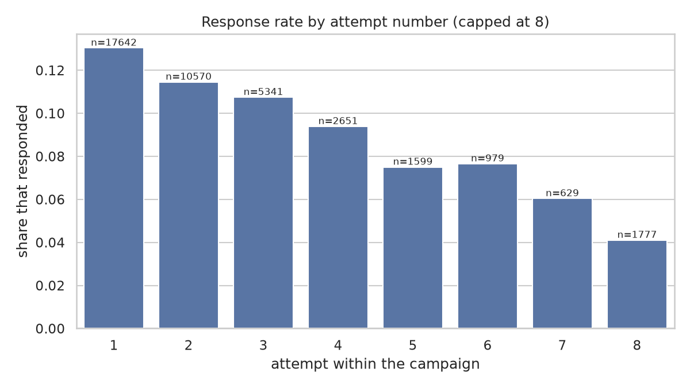
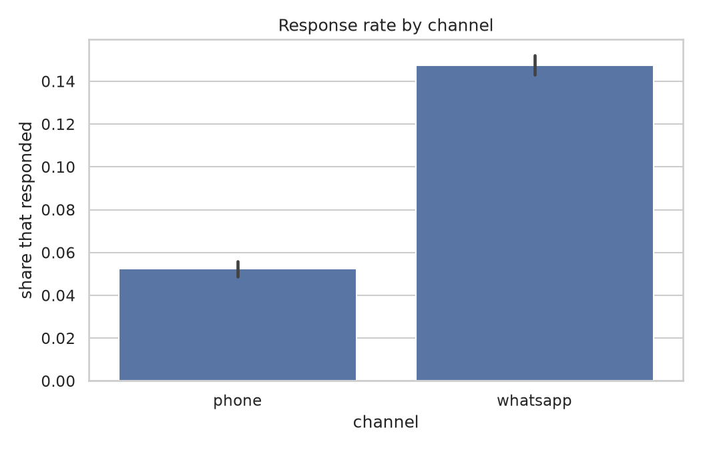
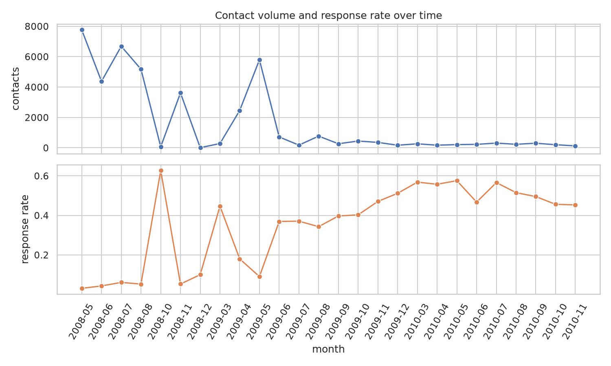
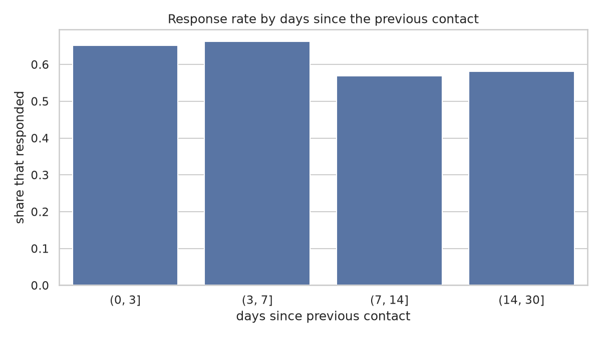

# Exploratory data analysis — contact strategy (`bank-marketing`)

> Generated by `collection eda`. This dataset carries contact attempts but no
> receivables, so the predictive tasks do not run on it; what follows is about
> contact pressure, which is what the active module needs.

## Volume

| table             |   rows |   columns |
|:------------------|-------:|----------:|
| customers         |  41188 |         8 |
| invoices          |      0 |        10 |
| collection_events |  41188 |        14 |
| agreements        |      0 |         7 |

## Outcomes

| outcome         |   contacts |
|:----------------|-----------:|
| no_answer       |      36548 |
| promised_to_pay |       4640 |

## Diminishing returns from repeated contact

|   attempt |   contacts |   response_rate |
|----------:|-----------:|----------------:|
|         1 |      17642 |          0.1304 |
|         2 |      10570 |          0.1146 |
|         3 |       5341 |          0.1075 |
|         4 |       2651 |          0.0939 |
|         5 |       1599 |          0.075  |
|         6 |       3385 |          0.0549 |

Response rate falls from 13.0% on the first attempt down to 5.5% by the sixth — a 58% fall. This is the empirical basis for a cooldown and an attempt cap in the rules engine, rather than escalating indefinitely.

## Response rate by channel

| channel   |   contacts |   response_rate |
|:----------|-----------:|----------------:|
| phone     |      15044 |          0.0523 |
| whatsapp  |      26144 |          0.1474 |

## Charts

