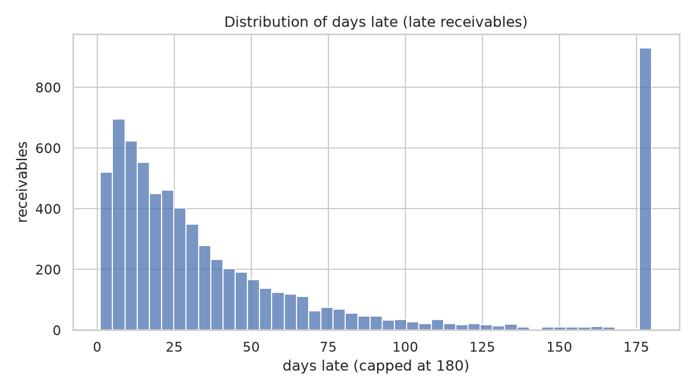
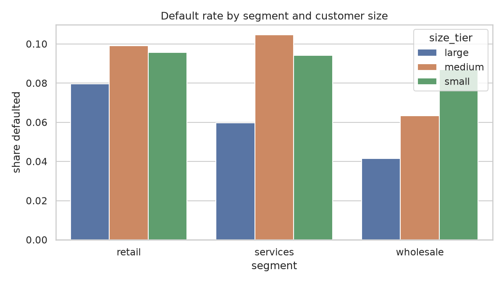
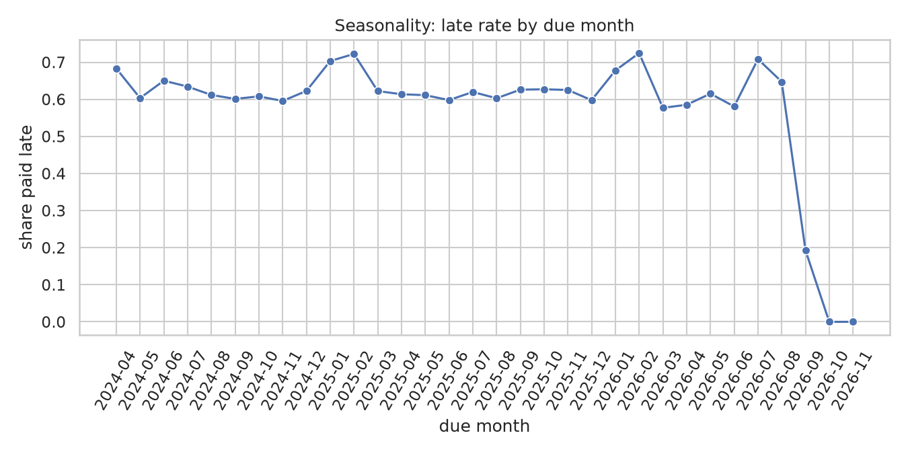
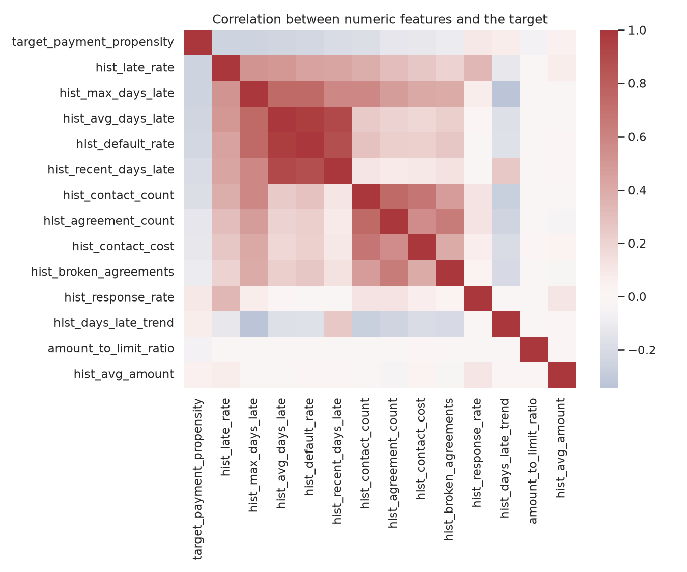

# Exploratory data analysis (`synthetic`)

> Generated by `collection eda`. Anonymized dataset in `data/interim/`.

## Volume

| table             |   rows |   columns |
|:------------------|-------:|----------:|
| customers         |   1200 |         8 |
| invoices          |  12000 |        10 |
| collection_events |  21290 |         9 |
| agreements        |    679 |         7 |

## Receivable status

| status    |   receivables |
|:----------|--------------:|
| paid_late |          5915 |
| paid      |          4287 |
| defaulted |          1094 |
| open      |           704 |

## Descriptive statistics

|       |    amount |   days_late |
|:------|----------:|------------:|
| count |  12000    |    12000    |
| mean  |   6064.37 |       57.29 |
| std   |  11413.9  |      147.21 |
| min   |     45    |        0    |
| 25%   |   1111.43 |        0    |
| 50%   |   2345.96 |        9    |
| 75%   |   5718.95 |       35    |
| max   | 170412    |      870    |

## Target and class imbalance

- Target analysed: `target_payment_propensity`
- Positive rate: **69.68%**
- Negative:positive ratio: **0.44:1**
- Eligible observations: **11177**

## Missing values (top 10)

|                           |   % missing |
|:--------------------------|------------:|
| invoice_id                |           0 |
| customer_id               |           0 |
| reference_date            |           0 |
| target_payment_propensity |           0 |
| amount                    |           0 |
| amount_to_limit_ratio     |           0 |
| credit_limit              |           0 |
| term_days                 |           0 |
| due_month                 |           0 |
| due_weekday               |           0 |

## Outliers

- Receivables more than 180 days late: 919 (7.66%); capped in the charts and kept for modelling, since they are genuine write-off cases.
- Amounts above the 99th percentile (59841.98): 120 receivables.

## Charts

