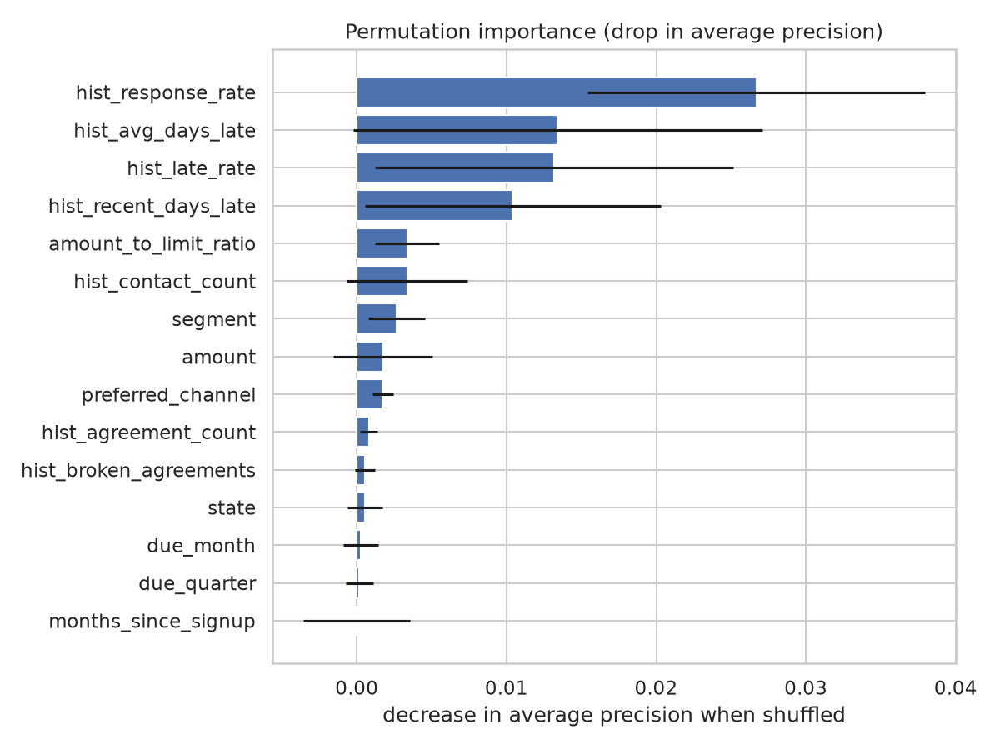
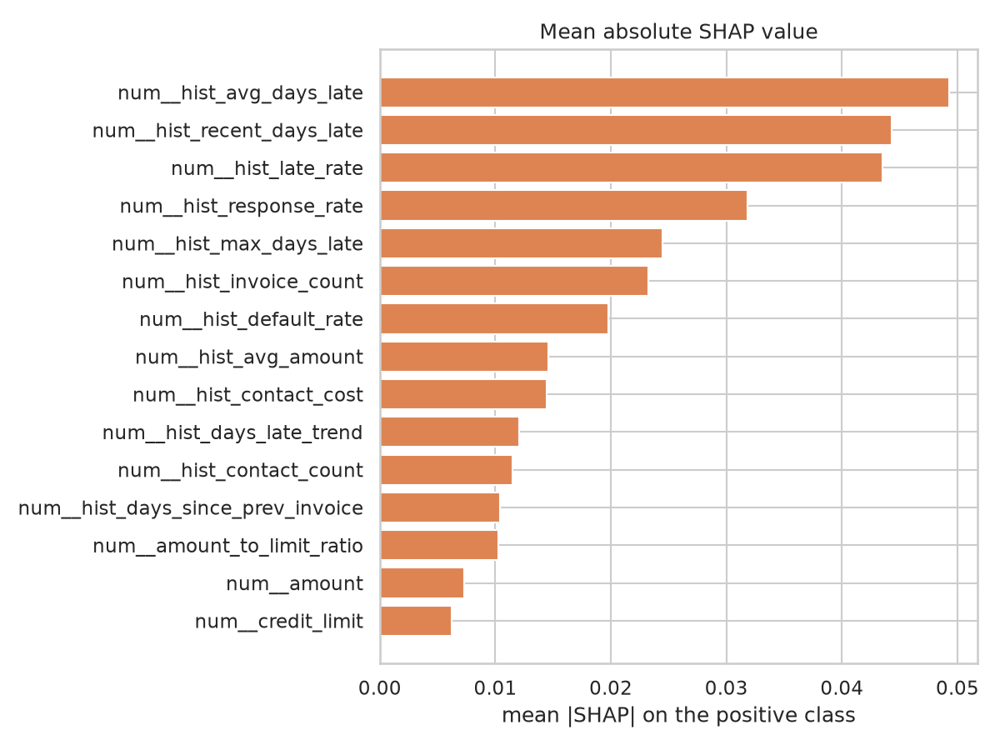

# Interpretability — default (`synthetic`)

> Generated by `collection explain`. Permutation importance is computed on the
> test split; SHAP values on a sample of it.

## Permutation importance

How much average precision the champion loses when a single column is shuffled.
A feature near zero is one the model does not actually use.

| feature                |   importance |     std |
|:-----------------------|-------------:|--------:|
| hist_response_rate     |      0.02668 | 0.01126 |
| hist_avg_days_late     |      0.01341 | 0.01366 |
| hist_late_rate         |      0.01319 | 0.01199 |
| hist_recent_days_late  |      0.01042 | 0.00987 |
| amount_to_limit_ratio  |      0.00336 | 0.00216 |
| hist_contact_count     |      0.00336 | 0.00404 |
| segment                |      0.00267 | 0.00188 |
| amount                 |      0.00175 | 0.00333 |
| preferred_channel      |      0.00173 | 0.00071 |
| hist_agreement_count   |      0.00082 | 0.00058 |
| hist_broken_agreements |      0.00054 | 0.00068 |
| state                  |      0.00054 | 0.00118 |
| due_month              |      0.00025 | 0.00117 |
| due_quarter            |      0.00018 | 0.0009  |
| months_since_signup    |      0       | 0.00356 |
| reference_date         |      0       | 0       |
| customer_id            |      0       | 0       |
| invoice_id             |      0       | 0       |
| opt_out                |     -6e-05   | 0.00012 |
| hist_days_late_trend   |     -8e-05   | 0.00344 |

## SHAP

Mean absolute SHAP value per encoded feature, on the positive class.

| feature                           |   mean_abs_shap |
|:----------------------------------|----------------:|
| num__hist_avg_days_late           |         0.04927 |
| num__hist_recent_days_late        |         0.04431 |
| num__hist_late_rate               |         0.04351 |
| num__hist_response_rate           |         0.03184 |
| num__hist_max_days_late           |         0.02445 |
| num__hist_invoice_count           |         0.02323 |
| num__hist_default_rate            |         0.01978 |
| num__hist_avg_amount              |         0.01455 |
| num__hist_contact_cost            |         0.01441 |
| num__hist_days_late_trend         |         0.01209 |
| num__hist_contact_count           |         0.01149 |
| num__hist_days_since_prev_invoice |         0.01039 |
| num__amount_to_limit_ratio        |         0.01027 |
| num__amount                       |         0.00733 |
| num__credit_limit                 |         0.00623 |
| num__months_since_signup          |         0.00602 |
| num__due_weekday                  |         0.00397 |
| cat__segment_wholesale            |         0.00341 |
| cat__segment_retail               |         0.00271 |
| cat__size_tier_small              |         0.00269 |

## Charts

