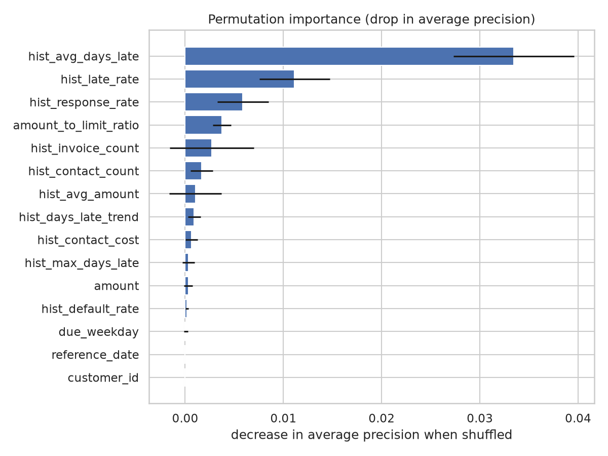
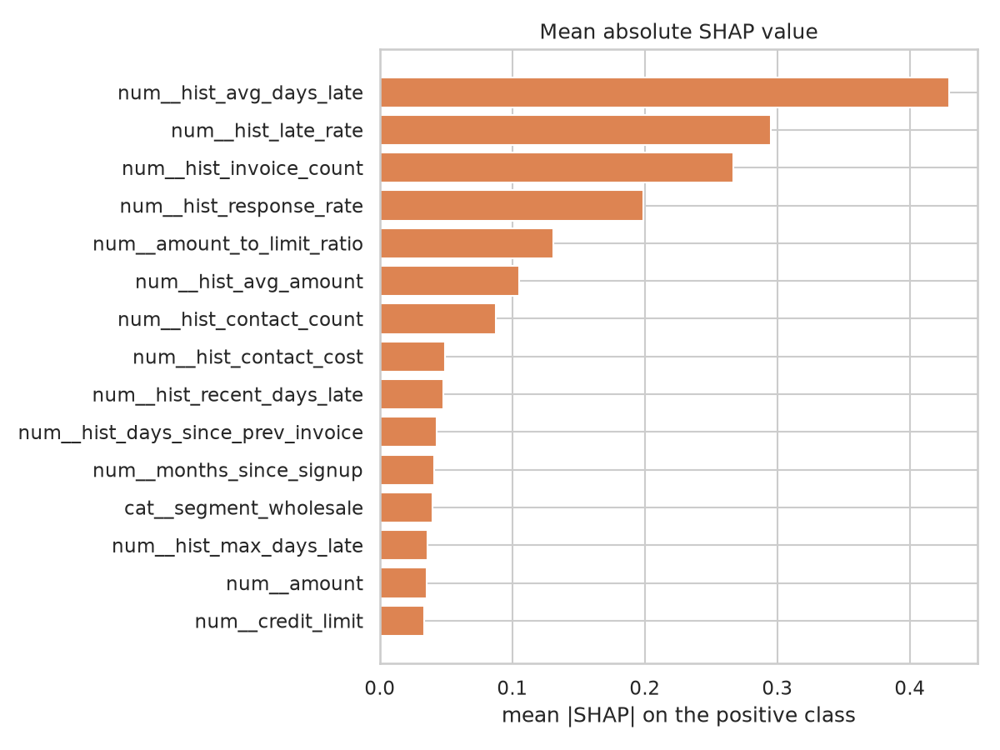

# Interpretability — propensity (`synthetic`)

> Generated by `collection explain`. Permutation importance is computed on the
> test split; SHAP values on a sample of it.

## Permutation importance

How much average precision the champion loses when a single column is shuffled.
A feature near zero is one the model does not actually use.

| feature               |   importance |     std |
|:----------------------|-------------:|--------:|
| hist_avg_days_late    |      0.03345 | 0.00614 |
| hist_late_rate        |      0.01112 | 0.00358 |
| hist_response_rate    |      0.00587 | 0.00261 |
| amount_to_limit_ratio |      0.00376 | 0.00093 |
| hist_invoice_count    |      0.00269 | 0.00428 |
| hist_contact_count    |      0.00168 | 0.00113 |
| hist_avg_amount       |      0.00104 | 0.00265 |
| hist_days_late_trend  |      0.00093 | 0.00066 |
| hist_contact_cost     |      0.00065 | 0.0006  |
| hist_max_days_late    |      0.00033 | 0.00061 |
| amount                |      0.00032 | 0.00043 |
| hist_default_rate     |      0.00018 | 0.00013 |
| due_weekday           |      8e-05   | 0.00019 |
| reference_date        |      0       | 0       |
| customer_id           |      0       | 0       |
| invoice_id            |      0       | 0       |
| due_quarter           |      0       | 0       |
| opt_out               |      0       | 0       |
| term_days             |     -0       | 4e-05   |
| size_tier             |     -3e-05   | 6e-05   |

## SHAP

Mean absolute SHAP value per encoded feature, on the positive class.

| feature                           |   mean_abs_shap |
|:----------------------------------|----------------:|
| num__hist_avg_days_late           |         0.42957 |
| num__hist_late_rate               |         0.29511 |
| num__hist_invoice_count           |         0.26693 |
| num__hist_response_rate           |         0.19914 |
| num__amount_to_limit_ratio        |         0.13103 |
| num__hist_avg_amount              |         0.10485 |
| num__hist_contact_count           |         0.08759 |
| num__hist_contact_cost            |         0.04938 |
| num__hist_recent_days_late        |         0.04761 |
| num__hist_days_since_prev_invoice |         0.04278 |
| num__months_since_signup          |         0.04074 |
| cat__segment_wholesale            |         0.03968 |
| num__hist_max_days_late           |         0.03599 |
| num__amount                       |         0.0354  |
| num__credit_limit                 |         0.03318 |
| cat__preferred_channel_whatsapp   |         0.02105 |
| num__hist_days_late_trend         |         0.01955 |
| num__due_quarter                  |         0.01953 |
| cat__segment_services             |         0.01123 |
| cat__due_month_2                  |         0.00932 |

## Charts

