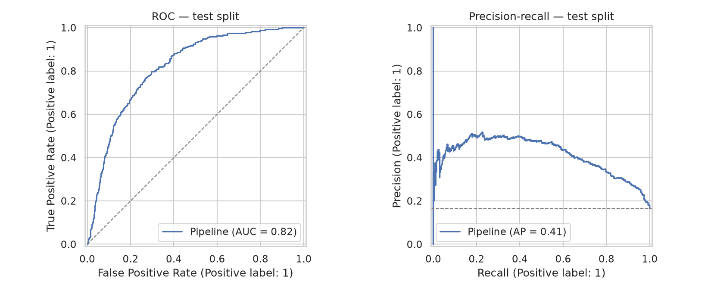

# Predictive model — default (`synthetic`)

> Generated by `collection train`. Selection metric: average precision on the
> validation split. The test split is scored once, after the champion is chosen.

> [!WARNING]
> **These numbers are not results.** They come from the synthetic generator,
> so they measure whether the models can recover a process that was designed
> into the data. They verify the training protocol; they say nothing about
> real payment behavior and must not be cited as findings.

- Target: `target_future_default`
- Champion: **random_forest + class_weight**
- Decision threshold (tuned on validation): **0.49**
- Splits: 7545 train / 1618 validation / 1617 test

## Model comparison

Cross-validation uses `TimeSeriesSplit` with k=5 on the training split, so no fold
is scored on rows that precede its own training data.

| model                              |   cv_average_precision |   cv_std |   accuracy |   precision |   recall |     f1 |   roc_auc |   average_precision |   brier |
|:-----------------------------------|-----------------------:|---------:|-----------:|------------:|---------:|-------:|----------:|--------------------:|--------:|
| random_forest + class_weight       |                 0.3501 |   0.0502 |     0.746  |      0.3644 |   0.5675 | 0.4438 |    0.7699 |              0.3872 |  0.1622 |
| xgboost + scale_pos_weight         |                 0.3325 |   0.0466 |     0.6755 |      0.3223 |   0.7405 | 0.4491 |    0.7654 |              0.3804 |  0.1966 |
| logistic_regression + class_weight |                 0.3406 |   0.0537 |     0.6854 |      0.3237 |   0.699  | 0.4425 |    0.7549 |              0.366  |  0.2064 |
| logistic_regression (baseline)     |                 0.3445 |   0.0523 |     0.8115 |      0.4322 |   0.1765 | 0.2506 |    0.7541 |              0.3658 |  0.132  |
| xgboost + smote                    |                 0.3115 |   0.05   |     0.801  |      0.3949 |   0.2145 | 0.278  |    0.7473 |              0.362  |  0.1365 |
| random_forest + smote              |                 0.3353 |   0.0525 |     0.7942 |      0.3942 |   0.2837 | 0.33   |    0.7555 |              0.3402 |  0.1423 |

## Test result (champion, scored once)

|   accuracy |   precision |   recall |     f1 |   roc_auc |   average_precision |   brier |
|-----------:|------------:|---------:|-------:|----------:|--------------------:|--------:|
|     0.7619 |      0.3803 |   0.7105 | 0.4954 |    0.8181 |              0.4143 |   0.154 |

### Against the majority-class baseline

A model is only useful if it beats predicting the majority class every time:

| model                        |   accuracy |   average_precision |   roc_auc |
|:-----------------------------|-----------:|--------------------:|----------:|
| majority class               |     0.8355 |              0.1645 |    0.5    |
| random_forest + class_weight |     0.7619 |              0.4143 |    0.8181 |

### Confusion matrix

|                 |   predicted negative |   predicted positive |
|:----------------|---------------------:|---------------------:|
| actual negative |                 1043 |                  308 |
| actual positive |                   77 |                  189 |

Positive rate in the test split: 16.45% (1617 receivables).

## Tuned hyperparameters

- `random_forest + class_weight`: {'model__min_samples_leaf': 10, 'model__max_features': 'sqrt', 'model__max_depth': 14}
- `xgboost + scale_pos_weight`: {'model__subsample': 0.9, 'model__min_child_weight': 5, 'model__max_depth': 3, 'model__learning_rate': 0.03}

## Curves

