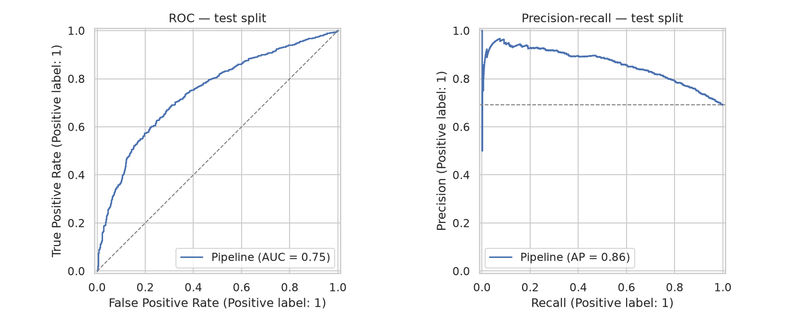

# Predictive model — propensity (`synthetic`)

> Generated by `collection train`. Selection metric: average precision on the
> validation split. The test split is scored once, after the champion is chosen.

> [!WARNING]
> **These numbers are not results.** They come from the synthetic generator,
> so they measure whether the models can recover a process that was designed
> into the data. They verify the training protocol; they say nothing about
> real payment behavior and must not be cited as findings.

- Target: `target_payment_propensity`
- Champion: **xgboost + scale_pos_weight**
- Decision threshold (tuned on validation): **0.23**
- Splits: 7823 train / 1677 validation / 1677 test

## Model comparison

Cross-validation uses `TimeSeriesSplit` with k=5 on the training split, so no fold
is scored on rows that precede its own training data.

| model                              |   cv_average_precision |   cv_std |   accuracy |   precision |   recall |     f1 |   roc_auc |   average_precision |   brier |
|:-----------------------------------|-----------------------:|---------:|-----------:|------------:|---------:|-------:|----------:|--------------------:|--------:|
| xgboost + scale_pos_weight         |                 0.8567 |   0.0313 |     0.6959 |      0.8413 |   0.6883 | 0.7571 |    0.7661 |              0.8753 |  0.195  |
| random_forest + class_weight       |                 0.8625 |   0.0231 |     0.715  |      0.8348 |   0.7307 | 0.7793 |    0.7635 |              0.8711 |  0.1883 |
| xgboost + smote                    |                 0.841  |   0.0375 |     0.7191 |      0.7676 |   0.8494 | 0.8064 |    0.7521 |              0.8684 |  0.1825 |
| random_forest + smote              |                 0.8552 |   0.0288 |     0.7215 |      0.7881 |   0.8147 | 0.8012 |    0.7578 |              0.8679 |  0.1815 |
| logistic_regression + class_weight |                 0.8487 |   0.0352 |     0.6977 |      0.824  |   0.7134 | 0.7647 |    0.7556 |              0.867  |  0.196  |
| logistic_regression (baseline)     |                 0.8488 |   0.0346 |     0.7305 |      0.7564 |   0.8978 | 0.8211 |    0.7544 |              0.8659 |  0.1799 |

## Test result (champion, scored once)

|   accuracy |   precision |   recall |     f1 |   roc_auc |   average_precision |   brier |
|-----------:|------------:|---------:|-------:|----------:|--------------------:|--------:|
|      0.709 |      0.7216 |   0.9431 | 0.8176 |    0.7457 |                0.86 |  0.2063 |

### Against the majority-class baseline

A model is only useful if it beats predicting the majority class every time:

| model                      |   accuracy |   average_precision |   roc_auc |
|:---------------------------|-----------:|--------------------:|----------:|
| majority class             |     0.6917 |              0.6917 |    0.5    |
| xgboost + scale_pos_weight |     0.709  |              0.86   |    0.7457 |

### Confusion matrix

|                 |   predicted negative |   predicted positive |
|:----------------|---------------------:|---------------------:|
| actual negative |                   95 |                  422 |
| actual positive |                   66 |                 1094 |

Positive rate in the test split: 69.17% (1677 receivables).

## Tuned hyperparameters

- `random_forest + class_weight`: {'model__min_samples_leaf': 10, 'model__max_features': 'sqrt', 'model__max_depth': 14}
- `xgboost + scale_pos_weight`: {'model__subsample': 0.9, 'model__min_child_weight': 5, 'model__max_depth': 3, 'model__learning_rate': 0.03}

## Curves

